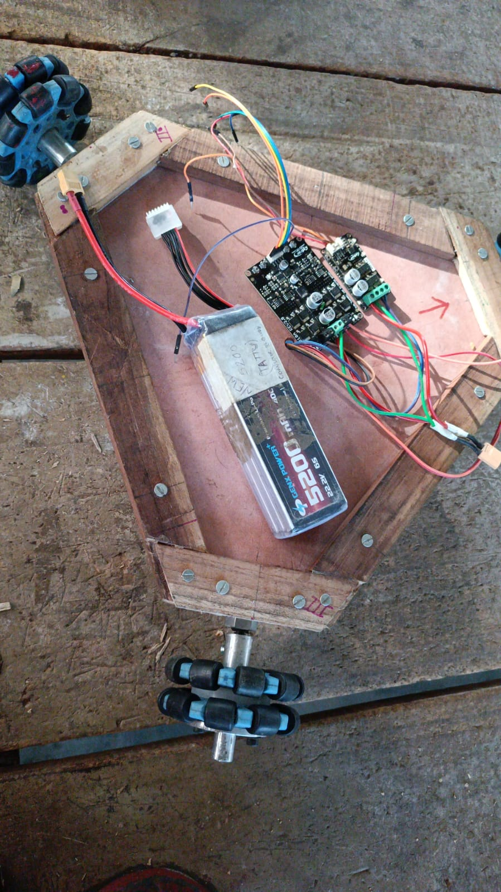

# 🤖 Omni-Wheel Robot – First Year Project

This is my **First Year Robotics Project**, where I built a **3-wheel Omni-Directional Robot** controlled using **Arduino + Serial Commands**.

The robot uses **omni-wheels** that allow it to move **forward, backward, sideways, and rotate** in any direction. It is powered by a **LiPo battery** and controlled by **Arduino with motor drivers**.

---

## ✨ Features

* 🔄 **Omni-directional movement** (Forward, Backward, Left, Right, Rotation)
* ⚡ **PWM-based speed control**
* 🎮 Control via **Serial Commands** (`F, B, L, R, C, A, S`)
* 🔋 Powered by a **5200mAh 22.2V LiPo battery** for high performance
* 🛠️ Beginner-friendly design for learning robotics & motor control

---

## 🛠️ Hardware Used

* Arduino UNO / Nano
* 3 Omni Wheels with DC Motors
* Motor Driver Boards (2x)
* LiPo Battery (5200mAh, 22.2V, 6S)
* Wooden Chassis (Custom-built)
* Jumper Wires & Connectors

---

## 🕹️ Command Controls

| Command | Action                |
| ------- | --------------------- |
| `F`     | Move Forward          |
| `B`     | Move Backward         |
| `L`     | Turn Left             |
| `R`     | Turn Right            |
| `C`     | Rotate Clockwise      |
| `A`     | Rotate Anti-Clockwise |
| `S`     | Stop All Motors       |

---

## ⚡ Circuit Overview

🔌 **Connections**

* Arduino → Motor Driver Inputs (`PWM + Direction pins`)
* Motor Drivers → 3 Omni Wheels
* Battery → Motor Driver Power Supply
* Serial Monitor → Send commands

*(See image of actual circuit setup below)*

---

## 🚀 How To Run

1. Upload the Arduino code to your board.
2. Connect Arduino to motor driver as per wiring.
3. Open **Serial Monitor** (baud rate: `9600`).
4. Enter commands (`F, B, L, R, C, A, S`).
5. Watch the robot move in the selected direction 🚗💨

---

## 🔮 Future Improvements

* Add **Bluetooth Module (HC-05)** for wireless control.
* Upgrade to **ESP8266/ESP32** for IoT-based control.
* Integrate **Ultrasonic Sensors** for obstacle avoidance.
* Develop a **mobile app** for robot navigation.

---

✨ This project was developed as a **First Year Practice Project** to learn about **Arduino, Motor Control, and Embedded Systems** 🚀
